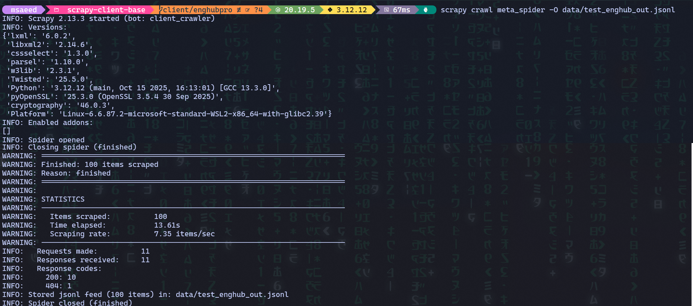

# 🕷️ Production-Grade Scraper Framework

> **Enterprise-ready Scrapy boilerplate** engineered for reliability, observability, and compliance.  
> Designed by [**Saeed Mohammadpour**](https://github.com/product-with-saeed) to help teams build  
> **10 K + record/day** data-collection pipelines that actually survive in production.


---

## 🧭 Overview
Most scrapers break the moment they hit production — rate-limits, retries, logging chaos.  
This framework shows how to design a **resilient, auditable Scrapy system** that can be monitored, redeployed, and trusted by real businesses.

### Perfect for
- Learning **production Scrapy architecture**
- Demonstrating **portfolio-level engineering quality**
- Bootstrapping commercial data-collection projects
- Serving as a **reference system** in interviews or tech audits

---

## ✨ Key Features

| Category | Highlights |
|-----------|-------------|
| **Core** | ✅ Production-ready settings (retry, throttling, robots.txt) <br> ✅ PostgreSQL pipeline with schema validation <br> ✅ Docker + docker-compose for one-command deploy |
| **Reliability** | ✅ Auto-throttling & retry logic <br> ✅ Duplicate prevention via DB constraints <br> ✅ Structured logging & error stats |
| **Security & Config** | ✅ `.env` support for credentials <br> ✅ Separate dev/prod configs <br> ✅ Rate-limit & delay controls |
| **Monitoring** | ✅ Health metrics & scrape stats <br> ✅ Logs & performance summaries |
| **Ethics Guardrails** | ✅ Robots.txt compliance <br> ✅ Legal usage guidance <br> ✅ Public-data only examples |

---

## 🧩 Architecture
<p align="center">
  
  
</p>

<p align="center"><em>Scrapy → Middleware → Validation → Pipeline → PostgreSQL → Docker → Monitoring</em></p>

### ⚙️ Runtime Flow

<p align="center">
  
  
</p>

<p align="center"><em>
  Nightly scraping sequence — scheduler triggers spider, middleware fetches data, validator cleans items, pipeline writes to PostgreSQL, and monitoring reports completion.
</p>


## 🚀 Quick Start

### Local Setup
```bash
git clone https://github.com/product-with-saeed/scrapy-production-template.git
cd scrapy-production-template
python3 -m venv venv
source venv/bin/activate  # or venv\Scripts\activate on Windows
pip install -r requirements.txt
````

### Database (PostgreSQL)

```bash
sudo -u postgres psql <<'SQL'
CREATE DATABASE scrapy_db;
CREATE USER scrapy WITH PASSWORD 'scrapy';
GRANT ALL PRIVILEGES ON DATABASE scrapy_db TO scrapy;
SQL
```

### Run a Spider

```bash
scrapy crawl hackernews
```

### View Data

```bash
psql -U scrapy -d scrapy_db -c "SELECT * FROM hackernews LIMIT 5;"
```

---

## 🐳 Docker Deployment

```bash
cp .env.example .env
docker-compose up -d
docker-compose exec scraper scrapy crawl quotes
docker-compose exec postgres psql -U scrapy -d scrapy_db -c "SELECT COUNT(*) FROM quotes;"
```

Deploy time: **< 5 minutes**

---

## 🕸️ Included Spiders

| Spider         | Domain             | Records | Notes                   |
| -------------- | ------------------ | ------- | ----------------------- |
| **HackerNews** | news aggregation   | ~30     | headlines & metadata    |
| **Quotes**     | content pagination | ~100    | quotes + authors + tags |
| **Books**      | e-commerce         | ~1 000  | titles, price, rating   |

---

## ⚙️ Configuration

`.env` example:

```env
POSTGRES_HOST=localhost
POSTGRES_DB=scrapy_db
POSTGRES_USER=scrapy
POSTGRES_PASSWORD=scrapy
POSTGRES_PORT=5432
LOG_LEVEL=INFO
```

Key settings (`scrapers/settings.py`)

```python
CONCURRENT_REQUESTS = 16
DOWNLOAD_DELAY = 1
RETRY_TIMES = 3
AUTOTHROTTLE_ENABLED = True
ROBOTSTXT_OBEY = True
```

---

## 📚 Documentation

Located in `/docs`

* **USAGE.md** → query examples, scheduling
* **DEPLOYMENT.md** → cloud & CI/CD setup
* **TROUBLESHOOTING.md** → common fixes

---

## 📊 Performance Snapshot

| Metric           | Value           |
| ---------------- | --------------- |
| Requests/min     | ~100            |
| Daily volume     | 10 K +          |
| Error rate       | < 1 %           |
| Memory footprint | < 500 MB/spider |
| Deploy time      | < 5 min         |

---

### 🧪 Example Run


*Sample run — 100 items scraped and stored in PostgreSQL pipeline with error tracking and completion stats.*


## 💼 Use Cases

| Scenario                  | Example                   |
| ------------------------- | ------------------------- |
| **E-commerce monitoring** | Track competitors’ prices |
| **Job aggregation**       | Consolidate listings      |
| **News analytics**        | Build datasets for NLP    |
| **Real estate tracking**  | Regional price trends     |
| **Research scraping**     | Academic data gathering   |

---

## 🧪 Testing

```bash
scrapy crawl hackernews -s CLOSESPIDER_ITEMCOUNT=5 -o test.json
scrapy crawl quotes -s LOG_LEVEL=DEBUG
psql -U scrapy -d scrapy_db -c "SELECT COUNT(*) FROM hackernews;"
```

---

## 🔒 Legal & Ethics

* ✅ Respect `robots.txt`
* ✅ Rate-limit responsibly
* ❌ Avoid personal data
* ❌ No circumvention of anti-bot systems

This repository is for **educational and portfolio purposes** only.
Always verify legal compliance before scraping production targets.

---

## 📬 Work With Me

Need a **custom, production-grade scraping or data-automation system**?
I design scalable Python backends and ETL pipelines that survive in real-world conditions.

📧 **[product.with.saeed@gmail.com](mailto:product.with.saeed@gmail.com)**
💼 [LinkedIn](https://linkedin.com/in/product-with-saeed)

---

## 🧑‍💻 Author

**Saeed Mohammadpour** — Senior Python Backend Developer | Ex-CTO
Specializing in backend architecture, automation, and data engineering.

---

## ⭐ Support

If this project helps you, please ⭐ star it — it helps others find reliable scraping resources.

---

**Built with ❤️ for the developer community**
MIT License © Saeed Mohammadpour
